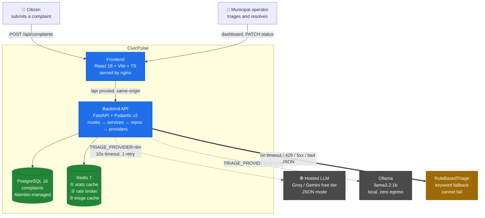

# CivicPulse

[](https://github.com/IfBilal/CivicPulse-SCD/actions/workflows/ci.yml)
[](LICENSE)
[](docs/00-SPEC.md)

> Municipal complaint intake, AI triage and operations platform.
> Built so the reader is replaceable: keyword rule today, LLM tomorrow, classifier next year.

## The problem

Every municipality runs the same broken process: a citizen's free-text complaint ("burst water
main flooding Street 12 since fajr") lands in an undifferentiated queue, sorted by nothing, and
by the time a human reads it a street is flooded. A dropdown category picker doesn't fix this —
citizens pick wrong, pick "Other" to finish the form faster, and can't judge urgency. The
information is in the text; somebody (or something) has to read it. The engineering problem this
system solves is not "read the text" — it's that **the reader must be replaceable**: a keyword
rule today, an LLM tomorrow, a fine-tuned classifier next year, and the surrounding system must
not fall over when the clever reader is rate-limited, slow, or simply wrong.

## Architecture



The thick arrow (`==>`) is the thesis: every provider failure — timeout, rate limit, malformed
JSON, the provider being entirely down — degrades to `RuleBasedTriage`, never to a 500. See
`docs/21-ARCHITECTURE-DIAGRAMS.md` for the network-boundary, layering, sequence, fallback-ladder,
state-machine, Kubernetes and CI/CD diagrams this one summarizes.

Full design docs live in [`docs/`](docs/) — [`docs/00-SPEC.md`](docs/00-SPEC.md) is the source of
truth; this file is the entry point, not a substitute for it.

## Quickstart

Requires Docker and Docker Compose. No API key needed — the default triage provider
(`TRIAGE_PROVIDER=simulated`) is a deterministic local simulation with no network calls.

```bash
make up
```

This builds every image, starts the stack, runs migrations, seeds ≥30 realistic complaints, and
waits for every healthcheck before returning. Once it prints the URL, open it:

```bash
# http://localhost:8080
```

Stop it (keeps data):

```bash
make down
```

Stop it and destroy all data:

```bash
make nuke
```

To use a real LLM instead of the simulation: copy `.env.example` to `.env` (done automatically by
`make up` if `.env` doesn't exist), set `TRIAGE_PROVIDER=llm` and the matching API key, then
`make up` again.

### Everyday commands

```bash
make check      # full local gate: lint, type-check, tests, layer/secret checks
make test       # backend + frontend test suites
make lint       # ruff + eslint
make type       # mypy + tsc --noEmit
make migrate    # alembic upgrade head, against the running stack
make seed       # re-run the seed script
make db-shell   # psql into the running database
```

Run `make help` for the full target list.

## Second command — Kubernetes

```bash
make k8s-up     # cluster + ingress-nginx + metrics-server + deploy the dev overlay
make k8s-down   # tear the cluster down
```

`make k8s-up` stands up a local k3d cluster, installs `ingress-nginx` and `metrics-server`, and
applies the `overlays/dev` Kustomize stack — namespace `civicpulse`, a `StatefulSet` for Postgres
with `volumeClaimTemplates`, `Deployment`s for backend/frontend/redis, an `HPA` on the backend,
and `ClusterIP` Services routed through one `Ingress`. See
[`docs/13-KUBERNETES.md`](docs/13-KUBERNETES.md) and
[`docs/14-LOAD-AUTOSCALING.md`](docs/14-LOAD-AUTOSCALING.md) for the full manifest set, HPA/VPA
behaviour, and the load-test runbook.

## API

Ten endpoints (`docs/04-CONTRACTS.md §6` — the spec's own endpoint table lists nine; the tenth,
the OpenAPI surface, is required implicitly by the typed client and shipped deliberately —
contradiction A3, resolved in `docs/00-SPEC.md` Appendix A):

| Method | Path | Purpose |
|---|---|---|
| `POST` | `/api/complaints` | Validate → triage → persist. `201` always for a syntactically valid body; `400` field-level errors; `429` + `Retry-After` when rate-limited. |
| `GET` | `/api/complaints/{id}` | Fetch one complaint. `200` / `404`. |
| `GET` | `/api/complaints` | Filter by `category`, `priority`, `status`; paginate (`page`, `page_size≤100`); returns `total`. |
| `PATCH` | `/api/complaints/{id}/status` | Advance the state machine via a transition-table lookup. Invalid transition → `409` naming the attempted transition. |
| `GET` | `/api/stats` | Aggregate counts by category/priority/status. Redis-cached, 30s TTL, `X-Cache: HIT\|MISS`. |
| `GET` | `/api/meta/providers` | Which triage provider is active, measured cache hit rate, and the last 20 triage outcomes (provider, latency, fallback y/n). The observability surface. |
| `GET` | `/health` | Liveness. Process is alive. **Never touches the database.** |
| `GET` | `/ready` | Readiness. `200` only if Postgres and Redis are both reachable; `503` naming the failed dependency. |
| `GET` | `/metrics` | Prometheus text format: request count/latency, triage latency, fallback counter — labelled by `path_template`, never a raw path. |
| `GET` | `/openapi.json` (+ `/docs`) | The tenth endpoint — the schema the typed frontend client is generated against (`docs/04-CONTRACTS.md §6.10`). |

## Triage providers

`TriageProvider` is a `Protocol` selected at runtime by `TRIAGE_PROVIDER`, so the classifier is a
swappable implementation, not a hardwired dependency:

| Provider | `TRIAGE_PROVIDER` value | Notes |
|---|---|---|
| `LLMTriage` | `llm` | Production path — Groq or Gemini free tier, JSON mode, 10s timeout, one jittered retry on timeout/429/5xx only. |
| `OllamaTriage` | `ollama` | Fully offline, zero egress, a container in Compose — same interface, slower and less accurate on CPU (the trade-off is the lesson). |
| `RuleBasedTriage` | `rules` | Deterministic keyword fallback. Always available, never fails — the target of every provider failure. |
| `SimulatedTriage` | `simulated` | Deterministic fake for CI/local dev — seeded, no network, configurable failure injection. **This is the default and what CI always uses.** |

Any provider failure — timeout, malformed JSON, wrong enum value, the provider being entirely
down — degrades to `RuleBasedTriage` with zero retries on validation errors, exactly one jittered
retry on timeout/429/5xx, inside a 12s total budget. `triaged_by="rules:fallback"` is recorded,
and `POST /api/complaints` still returns `201`. See ADR-0001 and
`docs/21-ARCHITECTURE-DIAGRAMS.md §5` (the fallback ladder).

## Screenshots

**TODO — pending a live deploy capture.** This sandbox has no running instance of the app to
screenshot honestly. See [`docs/evidence/`](docs/evidence/) below for the evidence artifacts that
substitute for screenshots today (terminal captures of network isolation, persistence, runtime
config, etc.) — Submit/Dashboard/Stats UI screenshots and the Grafana dashboard will be added
once a live deploy is captured, per `docs/18-DOCS-EVIDENCE-VIVA.md §1`.

## Configuration

Copy `.env.example` to `.env` (done automatically by `make up` if `.env` doesn't exist yet) and
edit as needed. `TRIAGE_PROVIDER=simulated` is the default — no external API key required to run
the full stack. See `.env.example`'s own comments for what each provider option needs, and
ADR-0004 for what leaves the machine when a real LLM provider is configured.

## Testing

```bash
pytest -m "unit or contract"   # fast loop, ~4s — run before every commit
pytest -m integration          # honest loop, ~90s — real Postgres/Redis via testcontainers
```

`TRIAGE_PROVIDER=simulated` in every test and CI run — never a live LLM call in CI. Coverage
floor is 65% on `app/`. The single most important test in the codebase is the fallback test:
given a provider that always raises, `POST /api/complaints` still returns `201` and
`triaged_by == "rules:fallback"`. See [`docs/16-TESTING.md`](docs/16-TESTING.md).

## Evidence

Artifacts in [`docs/evidence/`](docs/evidence/) that exist today:

| File | Proves |
|---|---|
| [`branch-protection.png`](docs/evidence/branch-protection.png) | `main` branch protection — PR required, review required, checks required |
| [`network-isolation.txt`](docs/evidence/network-isolation.txt) | `docker compose exec frontend ping database` fails; `backend` → `database` succeeds |
| [`persistence-compose.txt`](docs/evidence/persistence-compose.txt) | Row count survives `docker compose down` / `up` |
| [`persistence-k8s.txt`](docs/evidence/persistence-k8s.txt) | Row count survives `kubectl delete pod postgres-0` |
| [`netpol-enforcement.txt`](docs/evidence/netpol-enforcement.txt) | Kubernetes `NetworkPolicy` blocks frontend → postgres in-cluster |
| [`dockerignore-context-sizes.txt`](docs/evidence/dockerignore-context-sizes.txt) | `.dockerignore` before/after build-context size, both images >99% smaller |
| [`runtime-config.txt`](docs/evidence/runtime-config.txt) | One image digest running in two environments with different `config.js` |
| [`precommit-secret-block.txt`](docs/evidence/precommit-secret-block.txt) | Pre-commit gitleaks hook actually blocks a staged fake secret |

Remaining evidence named in `docs/18-DOCS-EVIDENCE-VIVA.md §3` (HPA/VPA captures, CI red→green
screenshots, merge-conflict drill artifacts, k6 summaries, etc.) is **not yet captured** — see
Known limitations below and `docs/20-RUBRIC-TRACEABILITY.md` for the live tracking sheet.

## ADRs

| ADR | Title |
|---|---|
| [0001](docs/adr/0001-provider-interface.md) | Triage provider interface — the `Protocol` shape, retry policy, why `ValidationError` is not retryable, why fallbacks are not cached |
| [0002](docs/adr/0002-frontend-runtime-config.md) | Frontend runtime configuration — nginx `/api` proxy as primary, `config.js` for non-URL flags, the build-once-deploy-many guarantee |
| [0003](docs/adr/0003-deploy-by-sha.md) | Deploy by digest, tag by SHA — why `:latest` is pushed but never deployed, the two rollback mechanisms |
| [0004](docs/adr/0004-pii-and-data-governance.md) | PII and data governance — what leaves the machine, to whom, and why that is acceptable |

## Known limitations

Pulled honestly from `docs/20-RUBRIC-TRACEABILITY.md` and the handover notes rather than hedged
generically:

- **Most rubric rows are still `PENDING`, not `PROVEN`.** `docs/20-RUBRIC-TRACEABILITY.md` tracks
  every scoring line against its implementation, test and evidence artifact; as of this README
  rewrite the majority of rows are unticked. This file is not a claim that the system is feature
  complete — it documents what exists today.
- **Backend routes are largely stubs.** Per `docs/handover/HANDOVER-feat-contract-freeze.md`, all
  ten route handlers were `501 not_implemented` stubs as of the contract-freeze phase; the
  four-layer implementation (services/repositories/providers) lands in later phases per
  `docs/02-CRITICAL-PATH.md`.
- **Frontend views (Submit/Dashboard/Stats) are not yet built.** Only the scaffold, router,
  typed client and MSW mocks exist as of Phase 2 (`docs/handover/HANDOVER-phase2-deva-to-devb.md`)
  — the actual views are Phase 4 scope.
- **`cd.yml` has not yet run against `main`.** The CD workflow (build-push, deploy-k8s) exists but
  a successful run against `main` — GHCR images, SBOM, cluster deploy, smoke test — is not yet
  captured. This is being addressed in a separate PR.
- **Rubric A3 (PR review rigor on `main`) needs improvement.** `docs/01-WORKFLOW.md §2.3` is
  explicit that a rubber-stamp review scores zero; this needs continued discipline as more PRs
  land, not a one-time fix.
- **HPA/VPA live captures are pending a live cluster run.** `kubectl get hpa -w`, the
  replicas-vs-load chart, and the VPA `Target`/`Lower Bound`/`Upper Bound` before/after
  recommendations (`docs/18-DOCS-EVIDENCE-VIVA.md §3`) require a running k3d/kind cluster under
  load and have not been captured yet.
- **UI screenshots and the Grafana dashboard are not captured** — see Screenshots above.
- **Merge-conflict drill evidence is not yet produced.** `docs/20-RUBRIC-TRACEABILITY.md` A5
  requires a deliberate, resolved merge conflict on `schemas/stats.py` with markers, graph, and a
  2–4 sentence rationale; this is planned per `docs/01-WORKFLOW.md §2.4` but not yet executed.
- **NetworkPolicy enforcement depends on the CNI.** `kind`'s default CNI (`kindnet`) does not
  enforce `NetworkPolicy`; the project standardizes on k3d specifically because of this
  (contradiction A13, `docs/00-SPEC.md` Appendix A) — using `kind` instead silently makes the
  policy decorative.
- **`/api/meta/providers`'s `recent` list is per-pod, not cluster-wide.** It's an in-process
  `deque(maxlen=20)`; scaling to multiple backend replicas fragments the observability view. A
  Redis-backed list would fix this but is not implemented (documented trade-off, `docs/04-CONTRACTS.md §6.6`).

## AI usage

All AI tool usage (Claude Code + skills, what was AI-shaped vs AI-written vs hand-written, and
what was overridden and why) is logged in [`docs/AI-USAGE.md`](docs/AI-USAGE.md), per
`docs/00-SPEC.md §5.5`: specific disclosure carries no penalty.

## Team

Two-developer assignment build (CS4032 Assignment 01). Contribution shares:

```
$ git shortlog -sn --no-merges
```

See [`docs/evidence/shortlog.txt`](docs/evidence/shortlog.txt) (once captured) for the pasted
output required by `docs/00-SPEC.md §5.8` item 5.

## Project layout

```
backend/    FastAPI app — routes/ → services/ → repositories/ → providers/, one-way imports
frontend/   React + Vite dashboard, typed against backend/openapi.json (never hand-edited)
k8s/        Kustomize base + dev/prod overlays
load/       k6 load-test scripts (HPA/VPA proof)
docs/       Design docs, one per phase — docs/00-SPEC.md is authoritative
scripts/    check_submission.py (automated rubric-deduction detectors) and friends
```

## Rules this repo enforces on itself

`docs/CLAUDE.md` is binding — secrets never committed, no direct pushes to `main`, SQL only in
`repositories/`, no `if status == ...` chains for the state machine, a triage-provider failure
never becomes a 500, and a fixed deduction ledger for anything from an unpinned image tag to a
broken quickstart. `scripts/check_submission.py` runs an automated detector for every line in
that ledger — see `make submission-check`.
