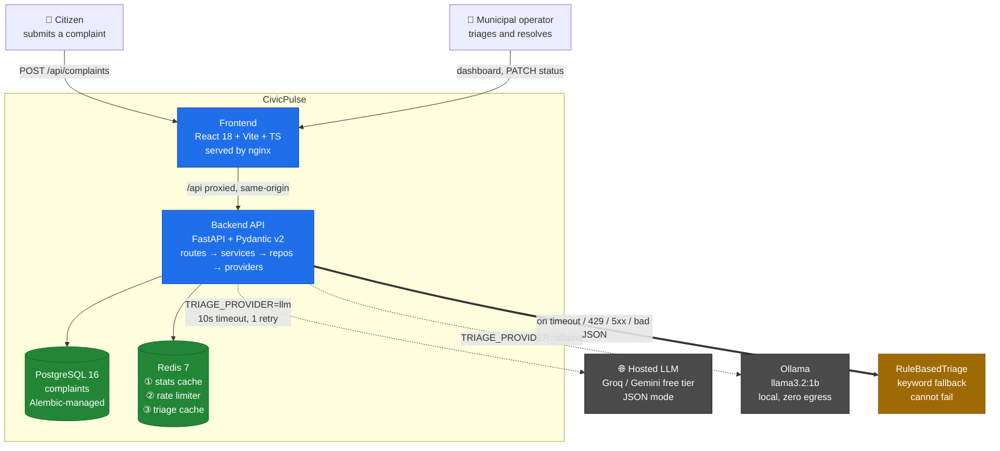
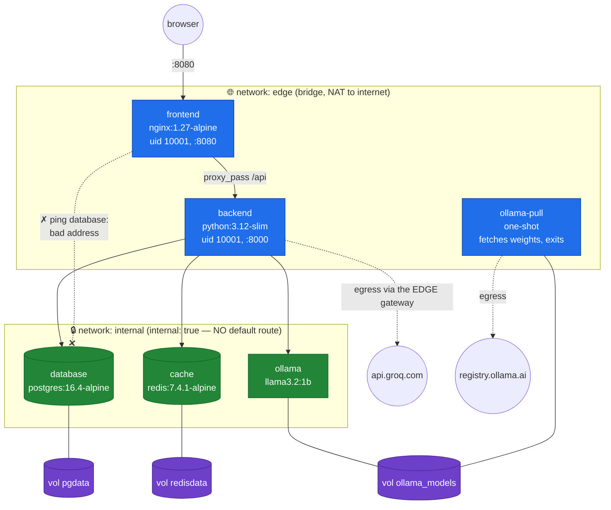
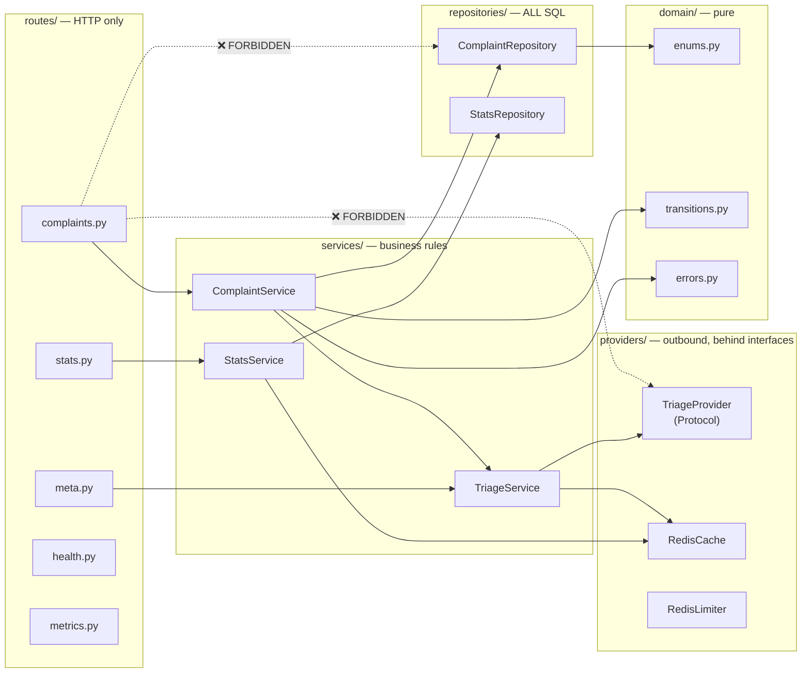
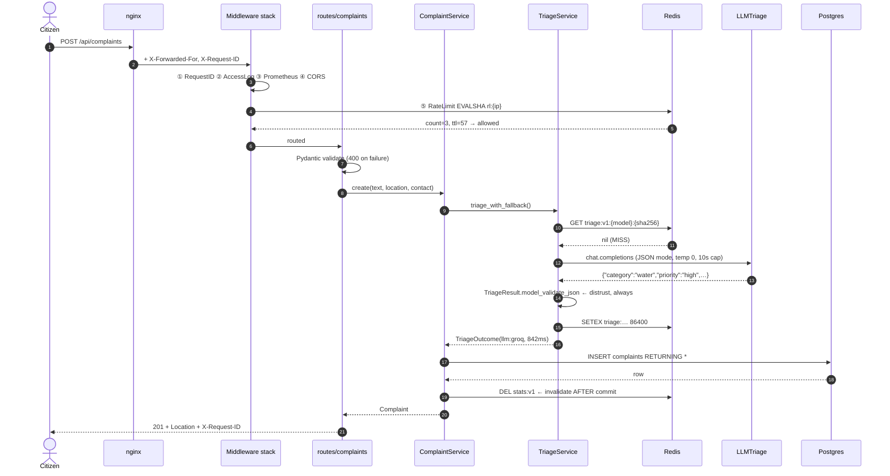
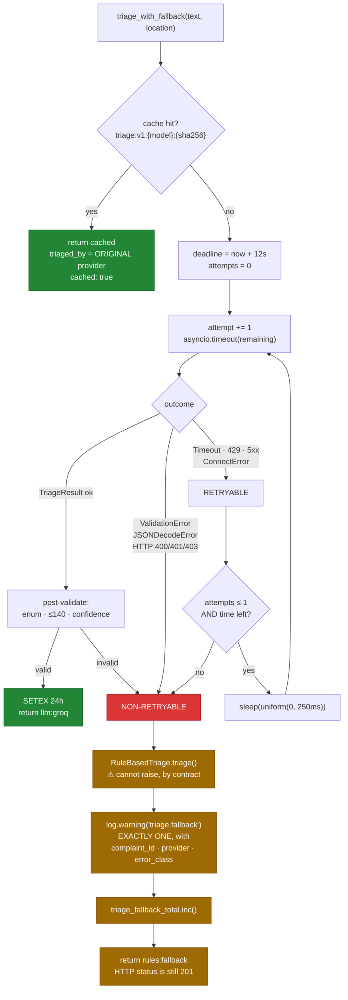
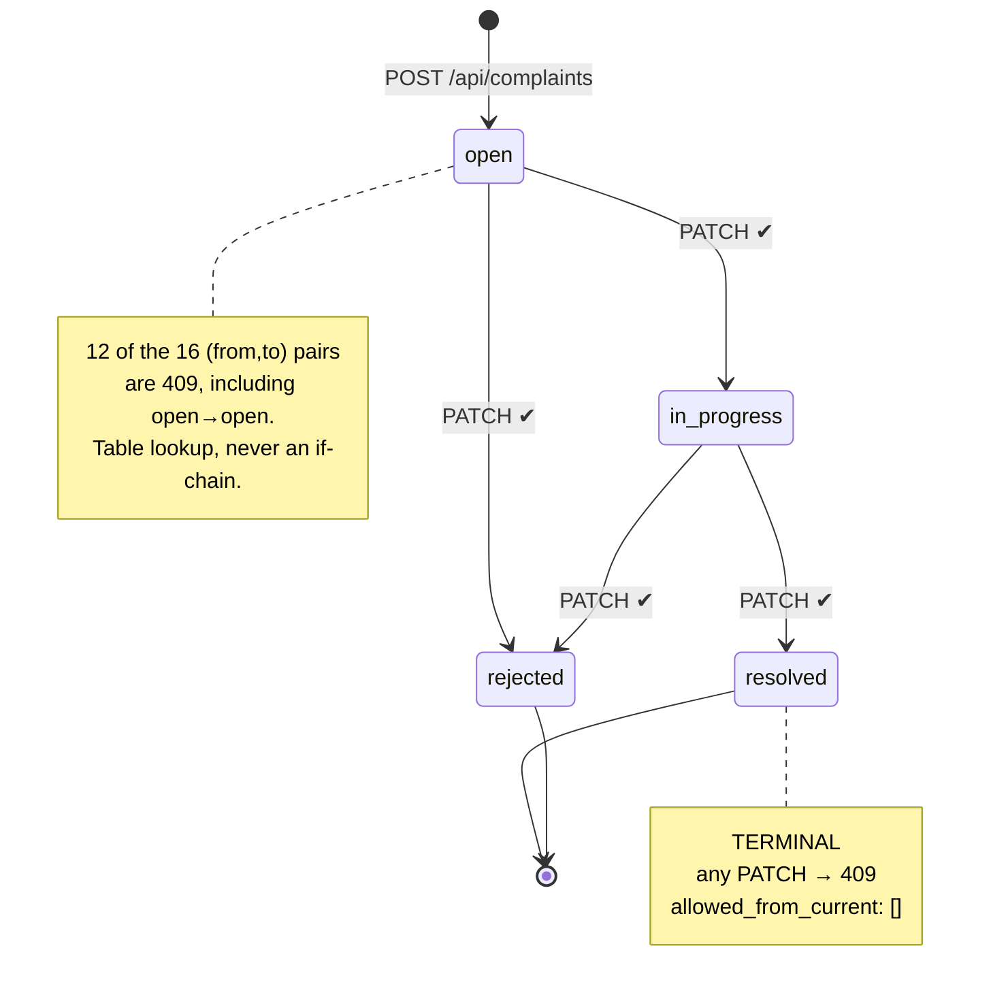
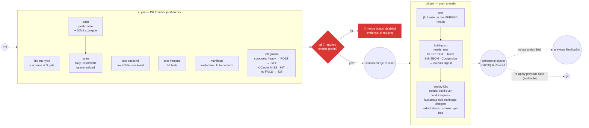
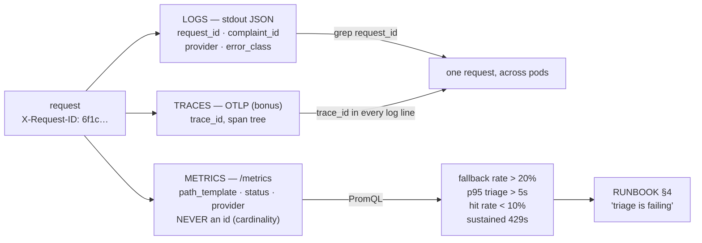

# 21 — ARCHITECTURE DIAGRAMS

> **Owner:** both · **Use:** README §Architecture (Rubric J1), the video's opening slide, and the
> whiteboard you will be asked to draw at the viva.
> Every diagram here is Mermaid, so it renders on GitHub without a build step and stays in version
> control as text. **Paste diagram §1 into the README** — Rubric J1 names a Mermaid architecture
> diagram explicitly.

---

## 1. System context (the README diagram)

**The thick arrow is the thesis.** Everything else is plumbing; the `==>` to `RuleBasedTriage` is
§1.1's *"the reader must be replaceable… and must not fall over when the clever one is
rate-limited, slow, or simply wrong."* When you present this diagram, point at that arrow first.

---

## 2. Container view with network boundaries

**Three facts this diagram encodes** (`12-DOCKER-COMPOSE.md §4.1`):
1. `frontend` is on `edge` only — the red crossed arrow is the marked demonstration.
2. `backend` is **dual-homed**, so it keeps internet egress via the `edge` gateway. `internal: true`
   does not sandbox a container; it removes a route from *one* of its networks.
3. `ollama` has no egress, which is why `ollama-pull` exists on `edge` sharing the same volume.

---

## 3. Backend component view (the four layers)

The dashed red edges are what `make lint-layers` fails the build on
(`05-DATA-LAYER.md §5`). §2.2: *"A route that opens a database session is a design failure worth
marks."* Arrows point **downward only** — nothing under `routes/` may import from `routes/`.

---

## 4. The POST /api/complaints happy path

Note step 5: the rate limiter runs **before body parsing**, so a flood of 2 MB malformed bodies
costs one Redis call, not a Pydantic parse each (`04-CONTRACTS.md §6.1`).

---

## 5. The fallback ladder — the diagram to draw at the viva

**Four things to say while drawing it:**
- `ValidationError` is on the **non-retryable** side (contradiction A14, §2.5 item 3 — *"never retry a
  400; the request was wrong and will be wrong again"*). A malformed response is deterministic
  under retry.
- The deadline guard means worst case is bounded at ~12 s, not 2 × 10 s + jitter.
- Fallback results are **not cached** — a transient outage must not freeze into 24 hours of
  keyword classification.
- The terminal node still says **201**. *"A user must never see a 500 because a third party was
  rate-limited."*

---

## 6. Status state machine

---

## 7. Kubernetes deployment view

```mermaid
graph TB
    IN["Ingress: civicpulse.localhost<br/>/ → frontend · /api → backend"]

    subgraph ns["namespace: civicpulse"]
        subgraph fe["Deployment frontend (2–N)"]
            F1["pod"]; F2["pod"]
        end
        subgraph be["Deployment backend (2–10, HPA)"]
            B1["initContainer: alembic upgrade head<br/>+ uvicorn, 3 probes, preStop sleep 5"]
            B2["pod"]
        end
        subgraph sts["StatefulSet postgres (1)"]
            P0["postgres-0"]
        end
        RD["Deployment redis (1)<br/>strategy: Recreate"]

        SF(["svc frontend<br/>ClusterIP"]); SB(["svc backend<br/>ClusterIP"])
        SP(["svc postgres<br/>ClusterIP None"]); SR(["svc redis<br/>ClusterIP"])

        CM["ConfigMap app-config"]; SE["Secret app-secrets<br/>placeholders in git"]
        HPA["HPA v2<br/>cpu 60%, 2–10<br/>up 0s / down 300s"]
        VPA["VPA updateMode: Off<br/>recommender only"]
        PDB["PDB minAvailable: 1"]
        NP["NetworkPolicy<br/>default-deny + allows"]
    end

    PVC1[("PVC pgdata-postgres-0<br/>re-bound by ordinal")]
    PVC2[("PVC redis-data")]

    IN --> SF --> fe
    IN --> SB --> be
    be --> SP --> sts
    be --> SR --> RD
    sts --- PVC1
    RD --- PVC2
    CM -.-> be
    SE -.-> be
    HPA -.->|scales| be
    VPA -.->|recommends only| be
    PDB -.->|guards| be
    NP -.->|enforced by CNI| ns
    be -.->|"egress :443 only"| EXT(("hosted LLM"))
```

**`PVC pgdata-postgres-0` is the whole StatefulSet argument in one label:** the claim is named
after the **ordinal**, so deleting the pod returns the same disk to the same identity. A Deployment
cannot promise that, which is why §3.3 calls it *"a marked error."*

---

## 8. CI/CD pipeline

The two `needs:` edges are worth **−16** if missing (§5.3, twice over). They are the reason a
broken commit cannot reach the registry with a plausible SHA tag.

---

## 9. Three-signal observability

Logs answer *what happened to this one request*; metrics answer *what is happening to all
requests*; traces answer *where the time went*. The join key is `request_id`, present in the
response header, the response body's error envelope, and every log line
(`10-OBSERVABILITY.md §3`).

---

## 10. Two-developer parallel schedule (Gantt)

```mermaid
gantt
    title CivicPulse — 14-day two-window plan (◆ = joint, ⏱ = wall-clock bound)
    dateFormat X
    axisFormat D%s

    section Critical path
    P0 bootstrap            :crit, 1, 1
    P1 contract freeze ◆    :crit, 2, 1
    P2 data                 :crit, 2, 2
    P3 backend API          :crit, 4, 1
    P4 AI triage            :crit, 5, 3
    P5 cache + limiter      :crit, 8, 1
    P5b compose integration :crit, 4, 1
    P6a CI                  :crit, 7, 2
    P6b kubernetes          :crit, 9, 2
    P7 load + autoscale ⏱   :crit, 10, 2
    P8a CD + rollback       :crit, 11, 2
    P8b evidence + video ⏱  :crit, 13, 2

    section DEV-B parallel (has float)
    FE scaffold             :2, 2
    Docker images           :3, 1
    FE views                :6, 2
    FE tests + runtime cfg  :7, 2
    Observability           :9, 1

    section Wall-clock, start Day 0
    Keys + k3d + VPA ⏱      :milestone, 0, 0
    Merge-conflict drill ◆  :milestone, 7, 0
    Red-gate evidence       :milestone, 8, 0
```

---

## 11. Which diagram goes where

| Diagram | Destination | Why |
|---|---|---|
| §1 context | **README** (Rubric J1) | Mermaid architecture diagram is named in the rubric |
| §2 networks | README §Architecture + video beat 4 | makes the crossed arrow legible before you demo it |
| §3 components | ENGINEERING-NOTES §Layering | evidence for Rubric C2 |
| §4 sequence | `docs/TRIAGE.md §1` | the request path, once, precisely |
| §5 fallback ladder | ADR-0001 + **the viva whiteboard** | the single most-asked design |
| §6 state machine | README §API + ADR | 16 cells, four legal |
| §7 k8s | README §Kubernetes + RUNBOOK | the ordinal-named PVC label is the StatefulSet argument |
| §8 pipeline | README §CI/CD | the two `needs:` edges are the deduction armour |
| §9 observability | `docs/RUNBOOK.md §3` | how a citizen's id becomes a log query |
| §10 Gantt | `01-WORKFLOW.md` / your planning issue | not for the marker; for you |

> **Viva tip:** be able to draw §5 from memory in sixty seconds, and §2 in thirty. Those two
> diagrams cover roughly half of the likely questions, and drawing beats describing.
