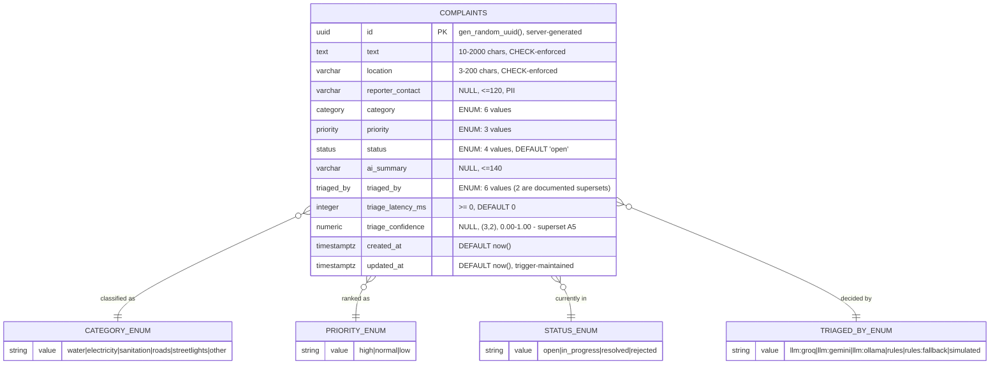

# 23 — ERD AND DATA DICTIONARY

> **Owner:** DEV-A · **Companion to:** `05-DATA-LAYER.md` (which holds the implementation)
> This file is the **schema of record**: the diagram, the column-by-column dictionary, the DDL,
> the Redis keyspace, and the evolution paths. If a column is not here, it does not exist.

---

## 1. Entity-relationship diagram



### 1.1 Why there is exactly one table

This is a real design decision, and *"why is there only one table?"* is a plausible viva question.

| Candidate table | Rejected because |
|---|---|
| `categories` lookup table | The category set is **closed, small and semantically load-bearing** — it is the output vocabulary of a classifier and the injection guardrail's teeth (`08-AI-TRIAGE.md §4.2` layer 4). A native PG `ENUM` gives DB-level rejection of an invalid value with zero joins. A lookup table would move that guarantee into an FK and add a join to every dashboard query for a set that changes at most once a year |
| `status_history` audit table | Genuinely useful, and genuinely **out of scope** — `00-SPEC.md §2.3` specifies a minimum schema and never mentions history. Adding it would be inventing requirements. It is the **first** thing v2 should add; see §6.1 |
| `triage_attempts` table | The last 20 outcomes live in an in-process ring (`07-BACKEND-API.md §6`), which the spec asks for. Persisting every attempt is an observability concern already served by `/metrics` and structured logs |
| `reporters` table | Would normalise `reporter_contact` and make PII deletion a one-row operation — attractive, but it creates an identity we do not otherwise need and complicates ADR-0004's *"transmission control, not storage control"* honesty |

**The principle:** normalise when the same fact is stored twice or when a set must change at
runtime. Neither applies. A single wide table with native enums and CHECK constraints is the
correct shape here, and being able to say *why* is worth more than a more elaborate schema.

---

## 2. Data dictionary — `complaints`

| Column | Type | Null | Default | Constraint | Source | PII | Notes |
|---|---|---|---|---|---|---|---|
| `id` | `uuid` | NO | `gen_random_uuid()` | PK | **server** | No | Built-in on PG13+; **no `pgcrypto` extension needed**. Seed rows override with a deterministic UUIDv5 so `ON CONFLICT (id) DO NOTHING` makes the seed idempotent |
| `text` | `text` | NO | — | `ck_complaints_text_len`: `char_length BETWEEN 10 AND 2000` | citizen | **Yes, unstructured** | §2.3 requires DB enforcement as well as app. `text` not `varchar(2000)` — in PG they are identical in storage; the CHECK is the authority |
| `location` | `varchar(200)` | NO | — | `ck_complaints_location_len`: `BETWEEN 3 AND 200` | citizen | **Yes** | Street-level, often a home address |
| `reporter_contact` | `varchar(120)` | YES | `NULL` | `ck_complaints_contact_len` | citizen | **Yes, direct** | **Never passed to `triage()`** — safety by interface design (`17 §4.2`) |
| `category` | `category_enum` | NO | — | native enum | **triage** | No | 6 values. An invalid value fails at the DB even if the app is bypassed |
| `priority` | `priority_enum` | NO | — | native enum | **triage** | No | 3 values |
| `status` | `status_enum` | NO | `'open'::status_enum` | native enum | operator | No | Transitions governed by `domain/transitions.py`, **not** by a DB constraint — see §3.3 |
| `ai_summary` | `varchar(140)` | YES | `NULL` | `ck_complaints_summary_len`: `<= 140` | **triage** | **Derived PII** — the model may copy a name | §2.3: *"one line, ≤140 chars"*. `NULL` only if a provider omitted it and rules produced none |
| `triaged_by` | `triaged_by_enum` | NO | — | native enum | system | No | **`rules:fallback` is the value the spec-mandated test asserts.** Two values (`llm:gemini`, `simulated`) are documented supersets — contradiction A4 |
| `triage_latency_ms` | `integer` | NO | `0` | `ck_complaints_latency_nonneg`: `>= 0` | system | No | §2.3: *"you cannot reason about cost or latency without measuring it"*. On a fallback row this is the **rules** duration (single-digit ms), which is why fallback rows look visibly different — useful, not a bug |
| `triage_confidence` | `numeric(3,2)` | YES | `NULL` | `ck_complaints_confidence_range`: `0 ≤ x ≤ 1` | **triage** | No | Superset A5. `NUMERIC` not `REAL` so `WHERE triage_confidence < 0.35` is exact |
| `created_at` | `timestamptz` | NO | `now()` | — | server | No | UTC. §2.3 |
| `updated_at` | `timestamptz` | NO | `now()` | — | **trigger** | No | `trg_complaints_updated_at` fires on **every** UPDATE, including raw SQL — unlike an ORM `onupdate` |

### 2.1 Enum value inventory

| Enum | Values | Cardinality | Change cost |
|---|---|---|---|
| `category_enum` | `water`, `electricity`, `sanitation`, `roads`, `streetlights`, `other` | 6 | `ALTER TYPE … ADD VALUE` (PG12+, non-blocking, **irreversible without a type swap**) |
| `priority_enum` | `high`, `normal`, `low` | 3 | same |
| `status_enum` | `open`, `in_progress`, `resolved`, `rejected` | 4 | same, **plus** a `TRANSITIONS` table entry or `C-T18` fails at import |
| `triaged_by_enum` | `llm:groq`, `llm:gemini`, `llm:ollama`, `rules`, `rules:fallback`, `simulated` | 6 | same |

> **The enum-removal trap, worth knowing:** PostgreSQL can `ADD VALUE` to an enum but cannot
> `DROP VALUE`. Removing one requires creating a new type, `ALTER TABLE … TYPE … USING`, and
> dropping the old — a real migration with a rewrite. That asymmetry is exactly why a `downgrade`
> for an enum-adding migration is non-trivial, and it belongs in the PR discussion when someone
> proposes a seventh category.

---

## 3. DDL of record

```sql
-- alembic/versions/0001_initial.py (upgrade)

CREATE TYPE category_enum   AS ENUM ('water','electricity','sanitation','roads','streetlights','other');
CREATE TYPE priority_enum   AS ENUM ('high','normal','low');
CREATE TYPE status_enum     AS ENUM ('open','in_progress','resolved','rejected');
CREATE TYPE triaged_by_enum AS ENUM ('llm:groq','llm:gemini','llm:ollama','rules','rules:fallback','simulated');

CREATE TABLE complaints (
    id                 uuid            PRIMARY KEY DEFAULT gen_random_uuid(),
    text               text            NOT NULL,
    location           varchar(200)    NOT NULL,
    reporter_contact   varchar(120),
    category           category_enum   NOT NULL,
    priority           priority_enum   NOT NULL,
    status             status_enum     NOT NULL DEFAULT 'open'::status_enum,
    ai_summary         varchar(140),
    triaged_by         triaged_by_enum NOT NULL,
    triage_latency_ms  integer         NOT NULL DEFAULT 0,
    triage_confidence  numeric(3,2),
    created_at         timestamptz     NOT NULL DEFAULT now(),
    updated_at         timestamptz     NOT NULL DEFAULT now(),

    CONSTRAINT ck_complaints_text_len         CHECK (char_length(text) BETWEEN 10 AND 2000),
    CONSTRAINT ck_complaints_location_len     CHECK (char_length(location) BETWEEN 3 AND 200),
    CONSTRAINT ck_complaints_contact_len      CHECK (reporter_contact IS NULL
                                                     OR char_length(reporter_contact) BETWEEN 3 AND 120),
    CONSTRAINT ck_complaints_summary_len      CHECK (ai_summary IS NULL OR char_length(ai_summary) <= 140),
    CONSTRAINT ck_complaints_latency_nonneg   CHECK (triage_latency_ms >= 0),
    CONSTRAINT ck_complaints_confidence_range CHECK (triage_confidence IS NULL
                                                     OR (triage_confidence >= 0 AND triage_confidence <= 1))
);

CREATE INDEX ix_complaints_status_priority ON complaints (status, priority);
CREATE INDEX ix_complaints_created_at      ON complaints (created_at DESC);

CREATE OR REPLACE FUNCTION set_updated_at() RETURNS trigger AS $$
BEGIN NEW.updated_at = now(); RETURN NEW; END;
$$ LANGUAGE plpgsql;

CREATE TRIGGER trg_complaints_updated_at
BEFORE UPDATE ON complaints
FOR EACH ROW EXECUTE FUNCTION set_updated_at();
```

**Downgrade must mirror it exactly**, including `DROP TYPE` — omitting that is the classic bug
where `downgrade` then `upgrade` fails with *"type category_enum already exists"*. Test D1 runs
the round trip.

### 3.1 Index justification (Rubric D3 — *each justified by a named query*)

| Index | Named query | Shape | Why this column order |
|---|---|---|---|
| `ix_complaints_status_priority` | **Q-DASH-FILTER** — `WHERE status=? AND priority=? ORDER BY created_at DESC LIMIT 20` | composite B-tree | `status` leads because operators live in `status='open'`; a status-only query still uses the index prefix. Reversed, the common single-predicate query loses the leading column |
| `ix_complaints_created_at (DESC)` | **Q-LIST-RECENT** — `ORDER BY created_at DESC LIMIT 20` | single-column, descending | Explicit `DESC` lets the planner walk forward and stop at 20 with **no sort node**. PG could scan an ASC index backwards, but the explicit direction states intent and pre-matches a future `(created_at DESC, id DESC)` tiebreaker |

Commit `EXPLAIN (ANALYZE, BUFFERS)` **before and after** each index to
`docs/evidence/explain-q-dash-filter.txt`. *Seq Scan → Bitmap Index Scan* is the line you point at.

**Disclosed gap:** neither index helps deep `OFFSET`. `OFFSET 5000` still walks 5000 rows. The
correct fix is keyset pagination (`WHERE (created_at, id) < (:last, :last_id)`), rejected because
§2.2 mandates a `page`/`page_size`/`total` envelope. *Knowing why you did the worse thing is worth
more than doing the better thing silently.*

### 3.2 What is deliberately **not** indexed

| Column | Why not |
|---|---|
| `category` alone | Six values over a small table — low selectivity; the planner would ignore it. It is covered as a filter predicate on an already-narrowed set |
| `triaged_by` | Analytics only; `/metrics` answers those questions without a table scan |
| `text` (full-text/GIN) | No search requirement in the spec. A `tsvector` + GIN index is the right v2 answer for "find complaints mentioning transformer" — named in §6.2, not built |

### 3.3 Where the state machine is **not** enforced

The transition rules live in `domain/transitions.py`, **not** in a DB constraint. Deliberate:

- A CHECK cannot see the **previous** value of a row; enforcing transitions in the database needs a
  `BEFORE UPDATE` trigger comparing `OLD.status` to `NEW.status`.
- That trigger would duplicate the table in PL/pgSQL, creating **two sources of truth** — the exact
  failure §2.1 warns about for the frontend, one layer down.
- The 409 must **name the attempted transition** and list `allowed_from_current`; a trigger raising
  `raise_application_error` gives a worse message and couples HTTP semantics to the database.

**What the database *does* guarantee** is atomicity: the conditional `UPDATE … WHERE id=? AND
status=:expected` makes the check-and-act a single statement, so two operators clicking at once
produce one 200 and one 409 rather than a lost update (test D9). The rule lives in the app; the
**race** is solved in the database. Be able to make that distinction.

---

## 4. Cardinality and growth

| Quantity | Expected | Basis |
|---|---|---|
| Rows after seed | 36 | `05-DATA-LAYER.md §6.2` |
| Rows after a full k6 run | ~15k–50k | 120 req/s × ~7 min of load stages |
| Row width | ~600 B average (text dominates) | 2000-char max, ~250-char typical |
| Table size at 50k rows | ~30 MB + ~4 MB indexes | fits the 2 Gi PVC many times over |
| Realistic municipal volume | 200–2000/day ⇒ ~700k/year | still single-node territory |
| First scaling concern | deep `OFFSET` on the dashboard, and `COUNT(*) OVER ()` at ~1M rows | §6.2 |

At the volumes this system will ever see in the assignment, **none of this matters** — and saying
so is better engineering than pretending it does. The interesting number is the **connection**
arithmetic, not the row count: HPA `maxReplicas: 10` × (`pool_size` 5 + `max_overflow` 2) = 70
connections against a default `max_connections=100` (`05-DATA-LAYER.md §1`).

---

## 5. The Redis keyspace (the other "schema")

Redis has no schema, which is exactly why it needs documenting.

| Key pattern | Type | TTL | Written by | Read by | Reconstructible? |
|---|---|---|---|---|---|
| `stats:v1` | string (JSON) | 30 s | `StatsService` on MISS | `GET /api/stats` | **Yes** — one SQL query |
| `lock:stats` | string | 3 s (`PX`) | stampede election (`SET NX PX`) | same | Yes |
| `rl:{ip}:{window_start}` | integer | window length | `fixed_window.lua` (atomic `INCR`+`EXPIRE`) | rate-limit middleware | **No — authoritative state** |
| `triage:v1:{model}:{sha256}` | string (JSON) | 86 400 s | `TriageService` after a **successful primary** call | `TriageService` before calling | **No — represents purchased quota** |

### 5.1 Key design notes

- **Version prefixes (`v1`) are manual invalidation generations.** Change the prompt or the stats
  shape ⇒ bump the prefix ⇒ every old entry becomes unreachable and expires naturally. No
  `FLUSHDB`, no downtime.
- **The model string is inside the triage key.** A cached `llama-3.1-8b` verdict must never be
  served as a `gemini-flash` verdict, because `triaged_by` would then lie.
- **Hash input normalisation is NFKC + casefold + whitespace-collapse only.** Do **not** strip
  punctuation or stopwords: *"water is coming"* and *"water is **not** coming"* must not collide.
  Over-normalising a cache key is a correctness bug that looks like a performance win (test F13).
- **Fallback results are never cached.** Freezing a transient outage into 24 hours of keyword
  classification is worse than paying for the retry (test F14, ADR-0001).
- **Two of the three keyspaces are not reconstructible**, which is the whole AOF justification
  (`09-CACHE-RATELIMIT.md §5`). The persistence requirement follows from *what you put in the box*,
  not from the box's category name.

### 5.2 Eviction interaction — the failure mode to know

`maxmemory 256mb` + `allkeys-lru` means Redis will, under pressure, evict **any** key — including a
live `rl:{ip}` counter. Consequence: a rate-limited client's counter can be evicted and their quota
silently resets. Acceptable here (the limiter protects a free tier, not a payment system), and the
alternative (`volatile-lru` with the limiter keys stored without a TTL) is worse because it lets the
limiter keyspace grow unbounded. **State the trade-off**; do not discover it in the viva.

---

## 6. Schema evolution paths (named, not built)

### 6.1 v2 — `status_history` (the first thing to add)

```sql
CREATE TABLE complaint_status_history (
    id            bigserial   PRIMARY KEY,
    complaint_id  uuid        NOT NULL REFERENCES complaints(id) ON DELETE CASCADE,
    from_status   status_enum,                       -- NULL on creation
    to_status     status_enum NOT NULL,
    changed_at    timestamptz NOT NULL DEFAULT now(),
    note          varchar(280),
    actor         varchar(120)                       -- requires auth, which v1 does not have
);
CREATE INDEX ix_csh_complaint_changed ON complaint_status_history (complaint_id, changed_at DESC);
```
Blocked on operator identity (§2.2 of the PRD's non-goals). Writing `actor` as `NULL` for every row
would be an audit log that audits nothing — a worse artefact than no table. Note that `note` in
`StatusUpdate` (`04-CONTRACTS.md §6.4`) is **accepted and discarded** in v1 precisely so the wire
contract does not have to change when this table lands.

### 6.2 v2 — full-text search

```sql
ALTER TABLE complaints ADD COLUMN text_tsv tsvector
  GENERATED ALWAYS AS (to_tsvector('simple', text || ' ' || location)) STORED;
CREATE INDEX ix_complaints_tsv ON complaints USING GIN (text_tsv);
```
`'simple'` rather than `'english'` because the corpus is Urdu-influenced English and English
stemming would mangle transliterated terms (`pani`, `bijli`, `khudda`). A generated column keeps
the index in sync with no trigger and no application change.

### 6.3 v2 — keyset pagination

Add `(created_at DESC, id DESC)` and a cursor-based envelope alongside the page-based one.
Requires a contract change, so it is a `chore/contract-*` PR with both reviewers.

### 6.4 v2 — retention (ADR-0004 §4.4)

```sql
UPDATE complaints
SET reporter_contact = NULL, text = '[redacted after 24 months]', ai_summary = NULL
WHERE created_at < now() - interval '24 months' AND reporter_contact IS NOT NULL;
```
Run as a scheduled job, as a **data** migration separate from any schema migration — a failed
backfill must not roll back a column add (`05-DATA-LAYER.md §3.3`).

---

## 7. Data-layer verification checklist

```bash
# structure
psql -c '\d+ complaints'
psql -c "SELECT conname, pg_get_constraintdef(oid) FROM pg_constraint
         WHERE conrelid='complaints'::regclass ORDER BY conname;"
psql -c "SELECT indexname, indexdef FROM pg_indexes WHERE tablename='complaints';"
psql -c "SELECT t.typname, e.enumlabel FROM pg_type t
         JOIN pg_enum e ON e.enumtypid=t.oid ORDER BY t.typname, e.enumsortorder;"
psql -c "SELECT tgname FROM pg_trigger WHERE tgrelid='complaints'::regclass AND NOT tgisinternal;"

# invariants
psql -c "INSERT INTO complaints (text,location,category,priority,triaged_by)
         VALUES ('too short','X','water','high','rules');"          -- expect 2 CHECK violations
psql -c "INSERT INTO complaints (text,location,category,priority,triaged_by)
         VALUES (repeat('a',20),'Street 12','weather','high','rules');" -- expect invalid enum
psql -c "UPDATE complaints SET location='Street 13' WHERE id=(SELECT id FROM complaints LIMIT 1)
         RETURNING created_at, updated_at;"                          -- expect updated_at > created_at

# migration round trip
alembic upgrade head && alembic downgrade base && alembic upgrade head
alembic revision --autogenerate -m "drift check"    # must produce an EMPTY migration, then delete it

# redis keyspace
redis-cli --scan --pattern 'stats:*'
redis-cli --scan --pattern 'rl:*'
redis-cli --scan --pattern 'triage:*' | head
redis-cli CONFIG GET appendonly maxmemory maxmemory-policy
```

Every line here is either a Gate-2 check or a viva demonstration. Run them once, paste the output
into `docs/evidence/`, and you can answer *"show me the schema"* by opening a file instead of
opening a connection.
